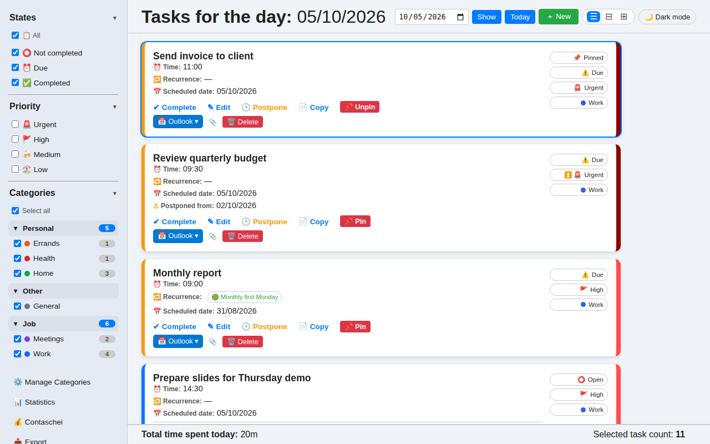
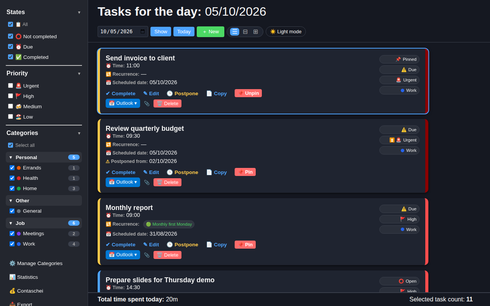
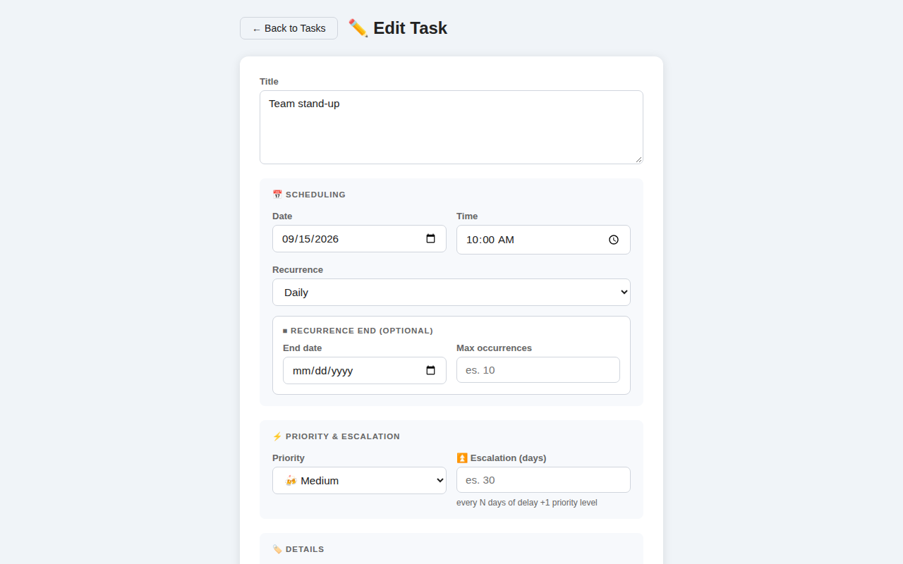
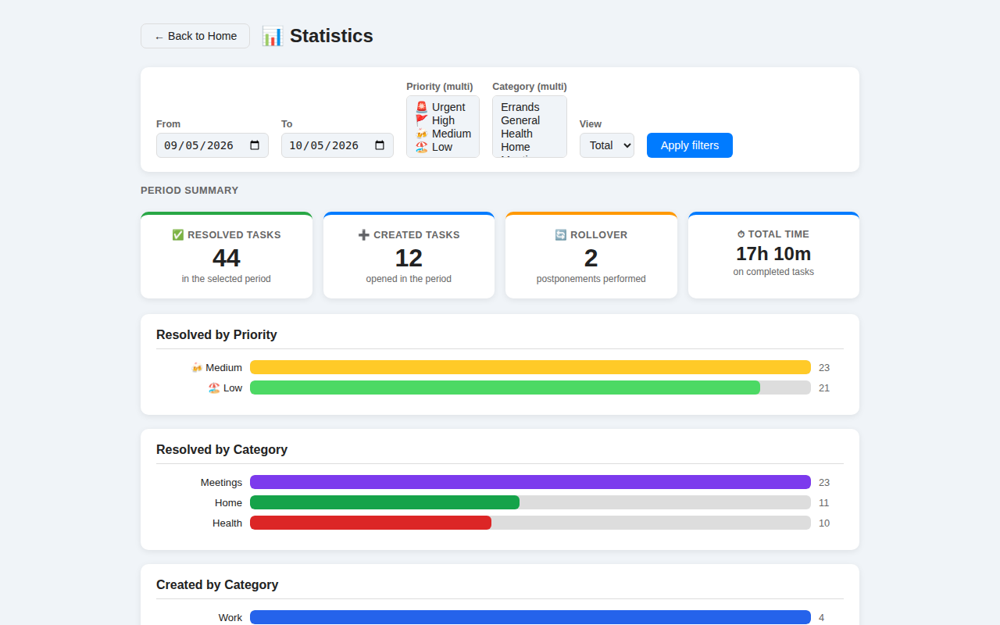
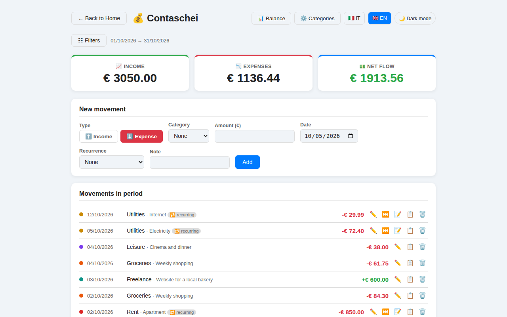

# 📋 TaskPlanner

A simple, private daily task planner for your desktop. Everything stays on your computer:
no account, no cloud, no tracking.

*🇮🇹 Pianificatore di attività giornaliere per desktop: i dati restano sul tuo computer,
nessun account, nessun cloud. Interfaccia in italiano e inglese.*



## Features

- **Daily view** with priorities, times, pinned tasks and custom card colors
- **Recurring tasks** (daily, weekly, monthly, first Monday, last Friday, …) with end date or max occurrences
- **Automatic rollover**: unfinished tasks move to today, with optional priority escalation the longer they wait
- **Categories and groups** with live filters and counters
- **Attachments** via drag & drop
- **Trash** with automatic cleanup after 7 days
- **Statistics** and **export** to CSV, JSON, TXT and Markdown
- **Contaschei**: a small personal income/expense tracker with recurring entries and period reports
- **Dark mode**, Italian and English UI
- **Outlook integration** on Windows (create events and tasks)

## Screenshots

| | |
|---|---|
|  |  |
| *Daily view, dark mode* | *Recurring task with escalation* |
|  |  |
| *Statistics* | *Contaschei: income and expenses* |

## Download

Get the latest version for Windows or Linux from the
[Releases page](https://github.com/doofie46-a11y/taskplanner/releases/latest).
It is a single executable: no installation needed.

**macOS:** no prebuilt binary for now (I have no Mac to test it on). TaskPlanner runs fine
[from source](#run-from-source); help testing a macOS build is welcome.

| OS | First launch |
|---|---|
| Windows | See [Windows SmartScreen](#windows-smartscreen) below. Requires the WebView2 runtime (preinstalled on Windows 10 21H2+ and Windows 11) |
| Linux | `chmod +x TaskPlanner-*-linux && ./TaskPlanner-*-linux` |

### Windows SmartScreen

The Windows executable is not code-signed yet, so on first launch Windows may show
*"Windows protected your PC"* with *Unknown publisher*. This warning appears for any new
unsigned program, not because something was detected in it. Click **More info** →
**Run anyway**.

Windows may also show an *"Open File – Security Warning"* saying the publisher could not
be verified, every time you start the program. To stop it, unblock the file once:
right-click it → **Properties** → check **Unblock** → **OK** (or untick *"Always ask before
opening this file"* in the warning). From PowerShell:

```powershell
Unblock-File .\TaskPlanner-*-windows.exe
```

Each new version you download is a new file, so you will need to do this again.

If you prefer to check the file first, [verify its checksum](#verify-the-download) or
[run TaskPlanner from source](#run-from-source).

### Verify the download

Every release includes a `SHA256SUMS.txt` file with the SHA-256 checksum of each executable,
computed by the same GitHub Actions run that built them. Compare it with your download:

```powershell
# Windows (PowerShell)
Get-FileHash .\TaskPlanner-*-windows.exe -Algorithm SHA256
```

```bash
# Linux (in the download folder, with SHA256SUMS.txt next to the executable)
sha256sum --check --ignore-missing SHA256SUMS.txt
```

Each executable also has a signed [build provenance attestation](https://docs.github.com/actions/security-for-github-actions/using-artifact-attestations)
that ties it to this repository and to the exact commit and workflow run that built it.
With the [GitHub CLI](https://cli.github.com):

```bash
gh attestation verify TaskPlanner-<version>-linux --repo doofie46-a11y/taskplanner
```

### Where your data lives

| OS | Folder |
|---|---|
| Windows | `%LOCALAPPDATA%\TaskPlanner\TaskPlanner\` |
| macOS | `~/Library/Application Support/TaskPlanner/` |
| Linux | `~/.local/share/TaskPlanner/` |

The database (`taskplanner.db`, SQLite) and attachments are in that folder: back it up to keep your data safe.
Set `TASKPLANNER_DATA=/some/path` to use a different folder.

### Uninstall

TaskPlanner does not install anything: delete the executable, and delete the data folder
above if you also want to remove your tasks.

## Privacy

TaskPlanner has no telemetry, no analytics and no update checks. The desktop app does not
connect to the internet on its own: your data stays in the local folder above. A web page
opens only when you click a link (the Ko-fi page, or Google Calendar when you add a task
to it). The Outlook integration talks only to the Outlook installed on your PC.

In [server mode](#server-mode) the data lives on the server of whoever runs it, and sign-in
goes through Google.

## Code signing policy

The Windows executable is not code-signed yet. We plan to apply for free code signing from
[SignPath Foundation](https://signpath.org) as the project grows. Signed releases will be
built only by the GitHub Actions workflow in this repository, from its own source code.

- Committers and reviewers: [doofie46-a11y](https://github.com/doofie46-a11y)
- Approver (authorizes each signed release): [doofie46-a11y](https://github.com/doofie46-a11y)

## Run from source

Requires Python 3.11+.

```bash
git clone https://github.com/doofie46-a11y/taskplanner.git
cd taskplanner
python -m venv venv
source venv/bin/activate          # Windows: venv\Scripts\activate
pip install -r requirements/desktop.txt
python app_desktop.py
```

### Build the executable

```bash
pip install -r requirements/desktop.txt pillow
python desktop/make_icons.py
pyinstaller taskplanner_desktop.spec    # output in dist/
```

Releases are built automatically by GitHub Actions for all three platforms when a `vX.Y.Z` tag is pushed.

## Server mode

The same codebase can also run as a multi-user web app (PostgreSQL). The easiest way is
Docker Compose; you can also run it directly with `gunicorn app_server:app` (see
`.env.example` for the required settings).

### Docker Compose

```bash
git clone https://github.com/doofie46-a11y/taskplanner.git
cd taskplanner
cp .env.docker.example .env
# set SECRET_KEY and POSTGRES_PASSWORD in .env (e.g. with: openssl rand -hex 32)
docker compose up -d --build
docker compose exec app python -m server.manage create-user admin
```

Then open http://127.0.0.1:8000 and sign in. The stack runs the app and PostgreSQL 17;
the database and attachments live in the `db-data` and `app-data` volumes.

- **Access from other devices**: by default the port is published on `127.0.0.1` only. Put the
  app behind a reverse proxy with HTTPS (Caddy, nginx, Traefik…), or set
  `TASKPLANNER_BIND=0.0.0.0` in `.env` for plain HTTP on your LAN. Don't expose it to the
  internet without HTTPS: passwords and session cookies would travel in clear text.
- **Update**: `git pull && docker compose up -d --build`. Database migrations run automatically
  at startup.
- **Backup**: `docker compose exec db pg_dump -U taskplanner taskplanner > taskplanner.sql`,
  plus the `app-data` volume for attachments.

### Sign-in

Users sign in with Google, with a username and password, or both:

- **Google**: set `GOOGLE_CLIENT_ID` and `GOOGLE_CLIENT_SECRET`.
- **Username and password**: enabled automatically when Google is not configured, or with
  `LOCAL_AUTH=true` next to Google. There is no public sign-up: accounts are created from the
  command line, with the same environment variables as the server (with Docker, prefix the
  commands with `docker compose exec app`):

  ```bash
  python -m server.manage create-user mario --name "Mario Rossi"
  python -m server.manage set-password mario   # reset a forgotten password, also unlocks
  python -m server.manage list-users
  ```

  Passwords are stored as salted hashes. After 5 wrong attempts an account is locked for
  15 minutes. Users can change their password from the key icon next to their name.

## Contributing

Bug reports and pull requests are welcome. User-facing strings must be wrapped in `_("…")`
and translated in `translations/en/LC_MESSAGES/messages.po` (Italian is the source language).

## Support

If TaskPlanner is useful to you, you can [buy me a beer 🍺](https://ko-fi.com/claudioruffina).

## License

[GNU AGPL v3.0](LICENSE). You may use, modify and redistribute TaskPlanner; modified versions
must be released under the same license, with source code. This also applies when you let
others use a modified version over a network (for example by hosting it as a web app): you must
offer them its source code. Set `TASKPLANNER_SOURCE_URL` to point the in-app "Source code" link
to your own repository.

Versions up to 1.5.2 were released under the GNU GPL v3.0; from 1.6.0 onwards TaskPlanner is
licensed under the AGPL v3.0.
